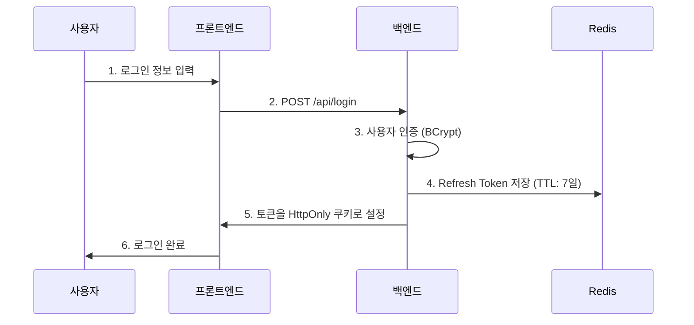
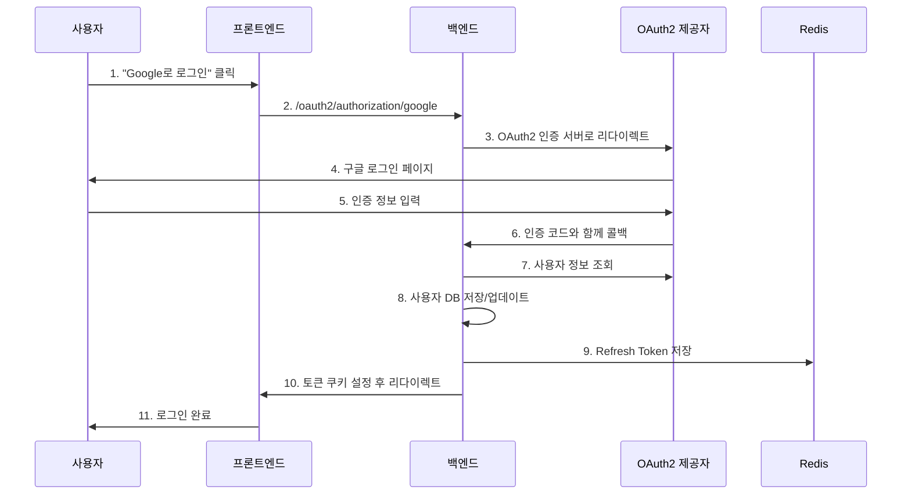
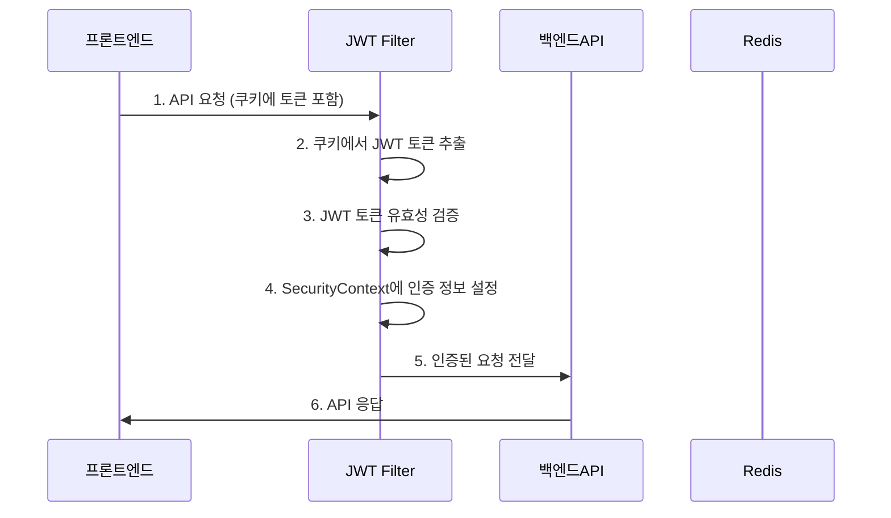
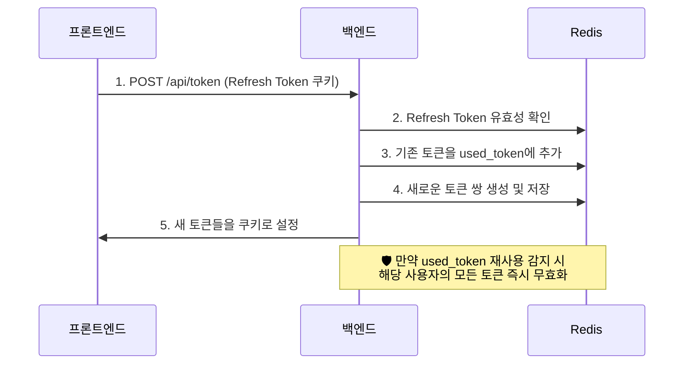

# 🛡️ PotentialRadar 인증 시스템 완전 가이드

## 📋 목차
1. [시스템 개요](#-시스템-개요)
2. [핵심 보안 전략](#-핵심-보안-전략)
3. [전체 인증 흐름](#-전체-인증-흐름)
4. [JWT 토큰 관리](#-jwt-토큰-관리)
5. [OAuth2 소셜 로그인](#-oauth2-소셜-로그인)
6. [능동 대응 토큰 시스템](#-능동-대응-토큰-시스템)
7. [Spring Security 필터 체인](#-spring-security-필터-체인)
8. [Redis 기반 토큰 저장소](#-redis-기반-토큰-저장소)

---

## 🎯 시스템 개요

PotentialRadar의 인증 시스템은 **능동 대응 보안**을 핵심으로 하는 현대적인 JWT 기반 인증 시스템입니다.

### 🔑 주요 특징
- **Redis 기반 토큰 관리**: 고성능 메모리 캐시로 확장성 확보
- **토큰 회전(Token Rotation)**: 매 갱신마다 새로운 토큰 쌍 생성
- **재사용 탐지**: 의심스러운 토큰 활동 자동 감지 및 차단
- **HttpOnly 쿠키**: XSS 공격 방지를 위한 보안 쿠키 사용
- **OAuth2 통합**: Google, Kakao 소셜 로그인 지원

---

## 🛡️ 핵심 보안 전략

### 1. 능동 대응(Proactive Response) 토큰 시스템

```
🔄 토큰 갱신 시마다 발생하는 보안 절차:

1️⃣ 기존 Refresh Token 검증
2️⃣ 재사용 토큰 감지 (공격자 탐지)
3️⃣ 기존 토큰을 used_token 리스트에 기록
4️⃣ 완전히 새로운 토큰 쌍 생성
5️⃣ 클라이언트에 새 토큰 전달 (쿠키)
```

### 2. 다중 보안 계층

| 보안 계층 | 기술 | 목적 |
|----------|------|------|
| **XSS 방지** | HttpOnly 쿠키 | JavaScript 접근 차단 |
| **CSRF 방지** | SameSite 쿠키 | 크로스 사이트 요청 방지 |
| **토큰 탈취 대응** | 토큰 회전 | 탈취된 토큰의 유효 기간 최소화 |
| **재사용 탐지** | used_token 블랙리스트 | 공격자의 토큰 재사용 즉시 감지 |
| **세션 무효화** | Redis TTL | 공격 감지 시 모든 토큰 즉시 무효화 |

---

## 🔄 전체 인증 흐름

### A. 일반 로그인 흐름



### B. OAuth2 소셜 로그인 흐름



### C. API 호출 인증 흐름



### D. 토큰 갱신 흐름 (능동 대응)



---

## 🎫 JWT 토큰 관리

### 토큰 구조

| 토큰 타입 | 만료 시간 | 용도 | 저장 위치 |
|----------|----------|------|----------|
| **Access Token** | 30분 | API 호출 인증 | HttpOnly 쿠키 |
| **Refresh Token** | 7일 | Access Token 갱신 | Redis + HttpOnly 쿠키 |

### 토큰 생명주기

```
📅 토큰 생명주기 관리:

🔄 Access Token (30분)
├─ 만료 시: 자동으로 Refresh Token으로 갱신
├─ 갱신 시: 기존 토큰 즉시 무효화
└─ 보안: 짧은 수명으로 탈취 피해 최소화

🔄 Refresh Token (7일)
├─ 사용 시: 새로운 토큰 쌍으로 회전
├─ 재사용 감지: 모든 세션 즉시 무효화
└─ Redis TTL: 만료 시 자동 삭제
```

---

## 🌐 OAuth2 소셜 로그인

### 지원 제공자

| 제공자 | 설정 | 특징 |
|--------|------|------|
| **Google** | `google` | 이메일 직접 접근 |
| **Kakao** | `kakao` | 중첩 구조 (`kakao_account.email`) |

### OAuth2 응답 구조

#### Google OAuth2 응답
```json
{
  "sub": "123456789",
  "name": "홍길동",
  "email": "user@gmail.com",        // ← 직접 접근
  "picture": "https://...",
  "email_verified": true
}
```

#### Kakao OAuth2 응답
```json
{
  "id": 987654321,
  "kakao_account": {
    "email": "user@kakao.com",      // ← 중첩 구조 접근
    "email_verified": true
  },
  "profile": { ... }
}
```

---

## ⚡ 능동 대응 토큰 시스템

### 재사용 탐지 메커니즘

```
🔍 토큰 재사용 탐지 로직:

1️⃣ 토큰 갱신 요청 수신
   ├─ Refresh Token 유효성 검사
   └─ used_token 리스트 확인

2️⃣ 재사용 여부 판단
   ├─ ✅ 정상: 새 토큰 발급 진행
   └─ ❌ 재사용 감지: 즉시 보안 모드 전환

3️⃣ 보안 모드 실행
   ├─ 해당 사용자의 모든 토큰 무효화
   ├─ 보안 로그 기록
   └─ 클라이언트에 재로그인 요구
```

### Redis 키 구조

```
📁 Redis 토큰 저장 구조:

refresh_token:{userId}:{tokenId}
├─ 값: RefreshTokenInfo 객체
├─ TTL: 7일 (604,800초)
└─ 구조: {
     "userId": 123,
     "tokenId": "uuid-string",
     "issuedAt": 1640995200000,
     "expiresAt": 1641600000000
   }

used_token:{userId}
├─ 값: Set<String> (사용된 토큰 ID 목록)
├─ TTL: 7일 (최대 Refresh Token 수명과 동일)
└─ 용도: 재사용 탐지용 블랙리스트
```

---

## 🔗 Spring Security 필터 체인

### 필터 실행 순서

```
🛡️ Spring Security 필터 체인 흐름:

1️⃣ CORS Filter
   └─ 크로스 도메인 허용 여부 확인

2️⃣ CSRF Filter
   └─ 토큰 기반이므로 비활성화

3️⃣ JWT Authentication Filter ← 커스텀 필터
   ├─ JWT 토큰 추출 및 검증
   └─ SecurityContext에 인증 정보 설정

4️⃣ OAuth2 Login Filter
   └─ 소셜 로그인 처리

5️⃣ Authorization Filter
   ├─ permitAll() vs authenticated() 체크
   └─ 접근 권한 확인

6️⃣ Controller 도달 ✅
```

### 접근 권한 설정

| 경로 패턴 | 권한 | 설명 |
|----------|------|------|
| `/api/login/**` | 공개 | 로그인 관련 엔드포인트 |
| `/api/signup` | 공개 | 회원가입 |
| `/api/token` | 공개 | 토큰 갱신 |
| `/oauth2/**` | 공개 | OAuth2 관련 엔드포인트 |
| `/api/search/**` | 공개 | 검색 기능 |
| `/api/projects/**` | 공개 | 프로젝트 조회 |
| 나머지 `/api/**` | 인증 필요 | 보호된 API |

---

## 📦 Redis 기반 토큰 저장소

### Redis 설정

```yaml
# application.yml
spring:
  redis:
    host: localhost
    port: 6379
    timeout: 2000ms
    lettuce:
      pool:
        max-active: 10    # 최대 연결 수
        max-idle: 10      # 최대 유휴 연결 수
        min-idle: 1       # 최소 유휴 연결 수
```

### TTL(Time To Live) 전략

```
⏰ TTL 관리 전략:

🔑 Refresh Token TTL
├─ 기본: 7일 (604,800초)
├─ 계산: jwtProperties.getRefreshTokenExpiration() / 1000
└─ 만료 시: Redis에서 자동 삭제

🚫 Used Token TTL
├─ 기본: 7일 (Refresh Token과 동일)
├─ 목적: 재사용 탐지 기간 보장
└─ 만료 후: 자동 정리로 메모리 효율성 확보
```

### Redis vs DB 비교

| 특징 | Redis | 기존 DB |
|------|-------|---------|
| **성능** | ⚡ 메모리 기반 (0.1ms) | 💾 디스크 기반 (10-100ms) |
| **확장성** | 📈 수평 확장 용이 | 📊 수직 확장 위주 |
| **TTL 지원** | ✅ 네이티브 지원 | ❌ 별도 배치 작업 필요 |
| **메모리 효율** | 🧹 자동 만료 삭제 | 🗑️ 수동 정리 필요 |

---

## 🔧 개발자 가이드

### 새로운 OAuth2 제공자 추가

1. **application.yml에 제공자 설정 추가**
```yaml
spring:
  security:
    oauth2:
      client:
        registration:
          naver:  # 새 제공자 예시
            client-id: ${NAVER_CLIENT_ID}
            client-secret: ${NAVER_CLIENT_SECRET}
            scope: email
```

2. **OAuth2AuthenticationSuccessHandler 수정**
```java
private String extractEmail(DefaultOAuth2User oAuth2User, String provider) {
    // 기존 코드...
    else if ("naver".equals(provider)) {
        // Naver 이메일 추출 로직 추가
        Map<String, Object> response = oAuth2User.getAttribute("response");
        return response != null ? (String) response.get("email") : null;
    }
    return null;
}
```

### 토큰 만료 시간 조정

```java
// JwtProperties.java
@Value("${jwt.access-token-expiration:1800000}")  // 30분 = 1800000ms
private long accessTokenExpiration;

@Value("${jwt.refresh-token-expiration:604800000}")  // 7일 = 604800000ms  
private long refreshTokenExpiration;
```

---

## 📊 모니터링 및 로깅

### 보안 관련 로그

```
✅ 성공 로그:
- "JWT 인증 성공: {사용자명}"
- "OAuth2 로그인 성공. Redis 토큰 발급 완료: {이메일}"
- "능동 대응 토큰 회전 완료"

❌ 경고/에러 로그:
- "유효하지 않은 JWT 토큰: {토큰 일부}"
- "토큰 재사용 감지! 사용자 {userId}의 모든 토큰 무효화"
- "OAuth2 로그인 처리 중 오류 발생"
```

### Redis 모니터링 포인트

- **메모리 사용량**: Redis 인스턴스 메모리 모니터링
- **연결 수**: 활성 연결 및 풀 상태 확인  
- **토큰 수**: 저장된 Refresh Token 개수 추적
- **TTL 분포**: 토큰 만료 시간 분포 분석

---

## 🚀 성능 최적화

### Redis 최적화

1. **Connection Pool 튜닝**
```yaml
spring:
  redis:
    lettuce:
      pool:
        max-active: 50     # 트래픽에 따라 조정
        max-wait: 3000ms   # 대기 시간 제한
```

2. **Serialization 최적화**
```java
// GenericJackson2JsonRedisSerializer 사용
// - 자동 타입 정보 포함으로 역직렬화 안정성 확보
// - JSON 형태로 가독성 향상
```

### JWT 성능 고려사항

- **토큰 크기**: 필요한 클레임만 포함하여 크기 최소화
- **서명 알고리즘**: HS256 사용으로 성능과 보안 균형
- **토큰 검증**: 매 요청마다 JWT 검증하므로 CPU 효율적 알고리즘 선택

---

이 문서는 PotentialRadar의 인증 시스템 전체를 다루며, 프로젝트 발표나 기술 면접에서 참고자료로 활용할 수 있습니다.